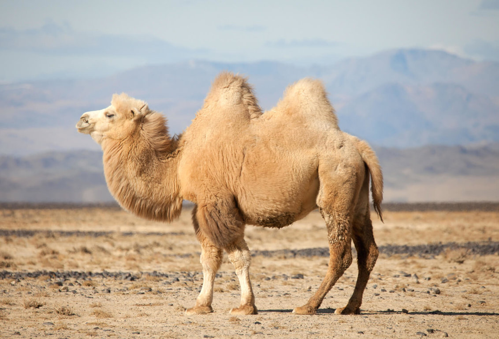
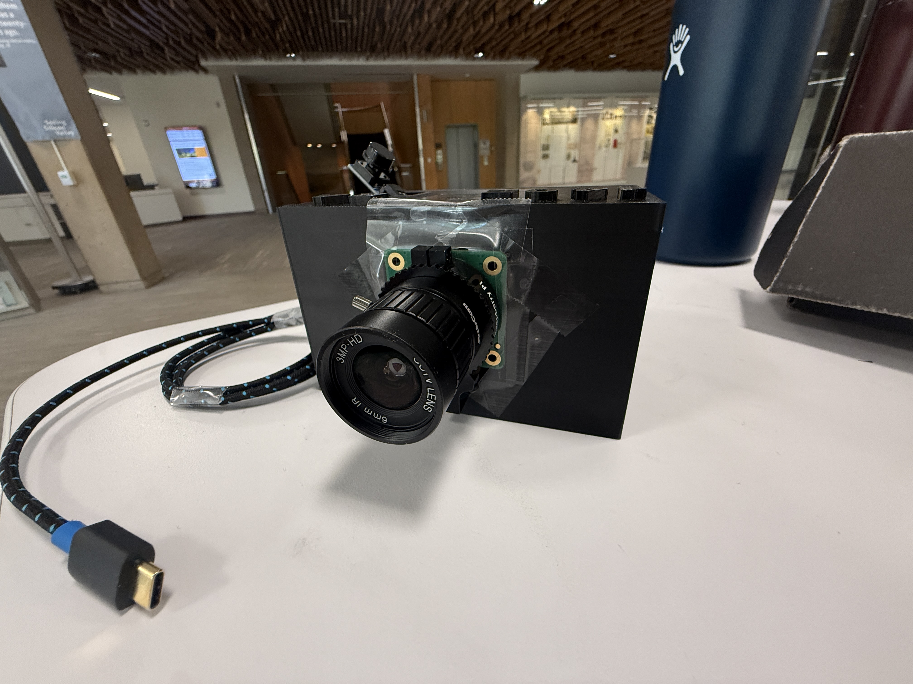
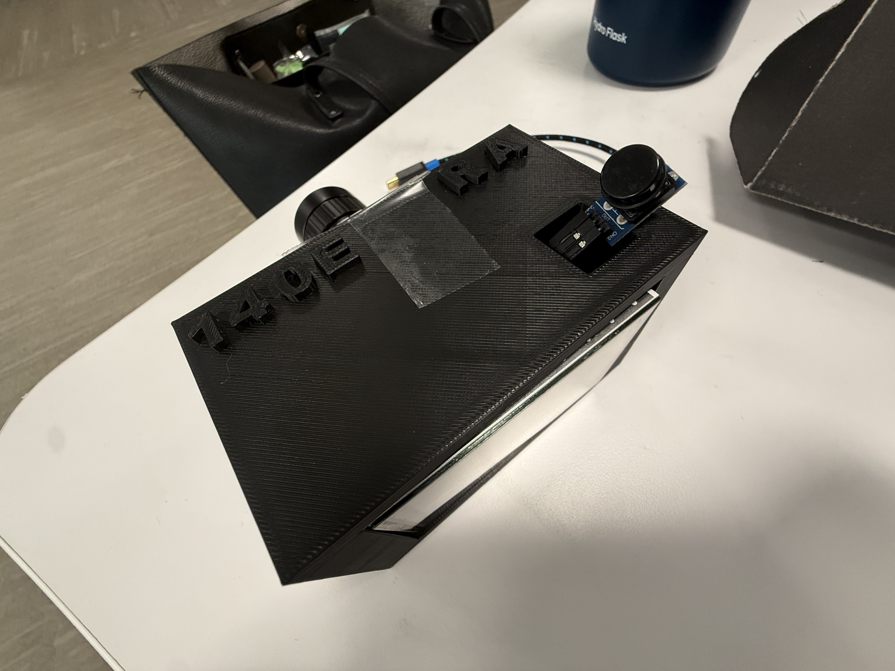
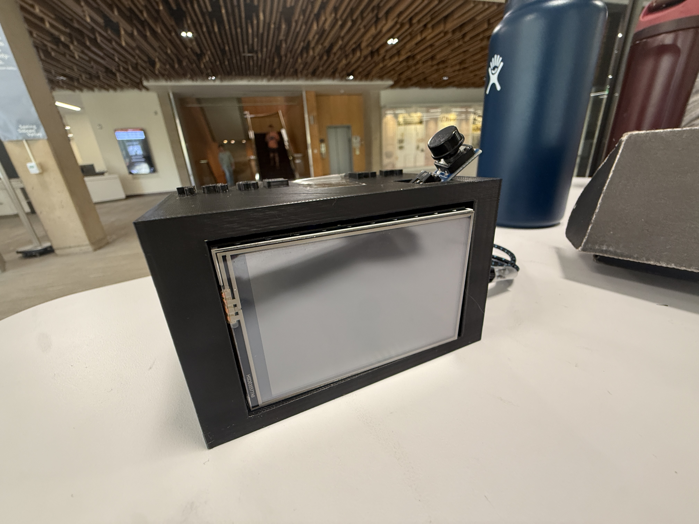
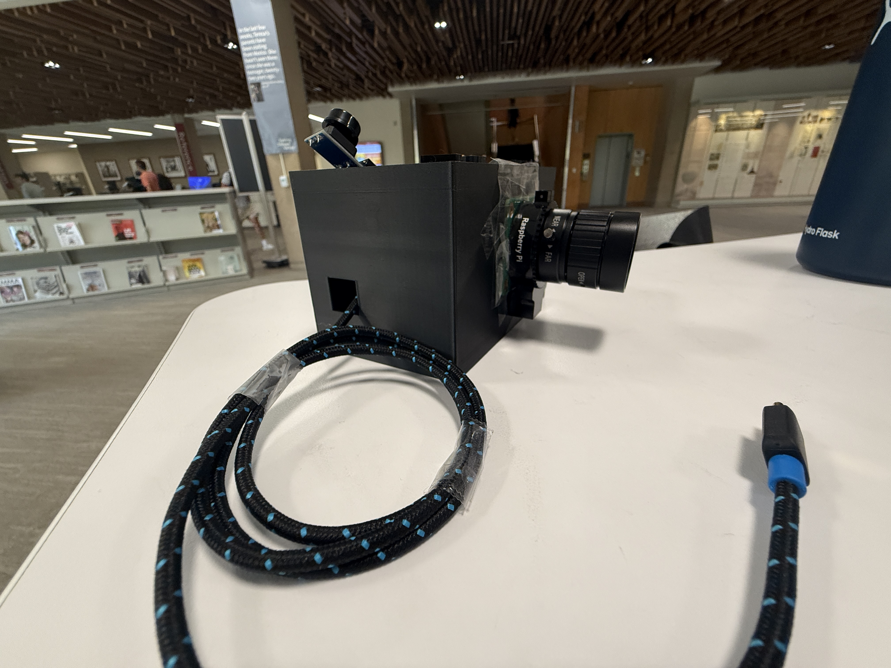

# CAMEL: A Camera by Riya and Aanya

This is our driver for the [raspberry pi HQ camera](https://www.raspberrypi.com/products/raspberry-pi-high-quality-camera/), written entirely bare metal (no OS, no problem!). For this project, we implemented 3 protocols (SPI, I2C, CSI-2) on arm peripherals, and a filesystem for writing out photos taken to an SD card. 

## Hardware
 * [Raspberry Pi 0](https://www.raspberrypi.com/products/raspberry-pi-zero-2-w/)
 * [Raspberry Pi HQ Camera](https://www.raspberrypi.com/products/raspberry-pi-high-quality-camera/)
 * [LCD Display](https://special-watercress-61d.notion.site/3-5inch-RPi-Display-2a9108be7df181468273ebd1d8175039)
 * [Button Module](https://www.amazon.com/dp/B0DQ3WM7K1?ref=ppx_yo2ov_dt_b_fed_asin_title)
 * [Arducam Lens -- we don't recommend](https://www.amazon.com/dp/B088GWZPL1?ref=ppx_yo2ov_dt_b_fed_asin_title)

## Wiring
 * HQ camera: bronze ribbon cable (22 - 15 pin cable)
 * Button: GPIO 21 for power, GPIO 20 for output
 * LCD: directly on the pins using the hat

## Assembly
If you would like to assemble your camera using a 3D print, you can use our template file
here: `docs/camera_casing_final.stl`. Below are images of how our final product looks:

## Usage
After copying the firmware onto your raspberry pi's SD card, you can choose which 
test you want to run from the `src/camera/code/tests/` directory by replacing the `kernel.img` with the `.bin` file. 
For our demo, we use `12-button-raw.bin`. Make sure you rename the file to `kernel.img`.
Once you connect the camera to power, it should start taking pictures when you click the
button, and save the .RAW files to your SD card while displaying to the LCD. If you would
prefer to save jpg files, please tune the white balance based on your laptop screen
as you see fit, and then use `11-button-jpeg.bin`.

